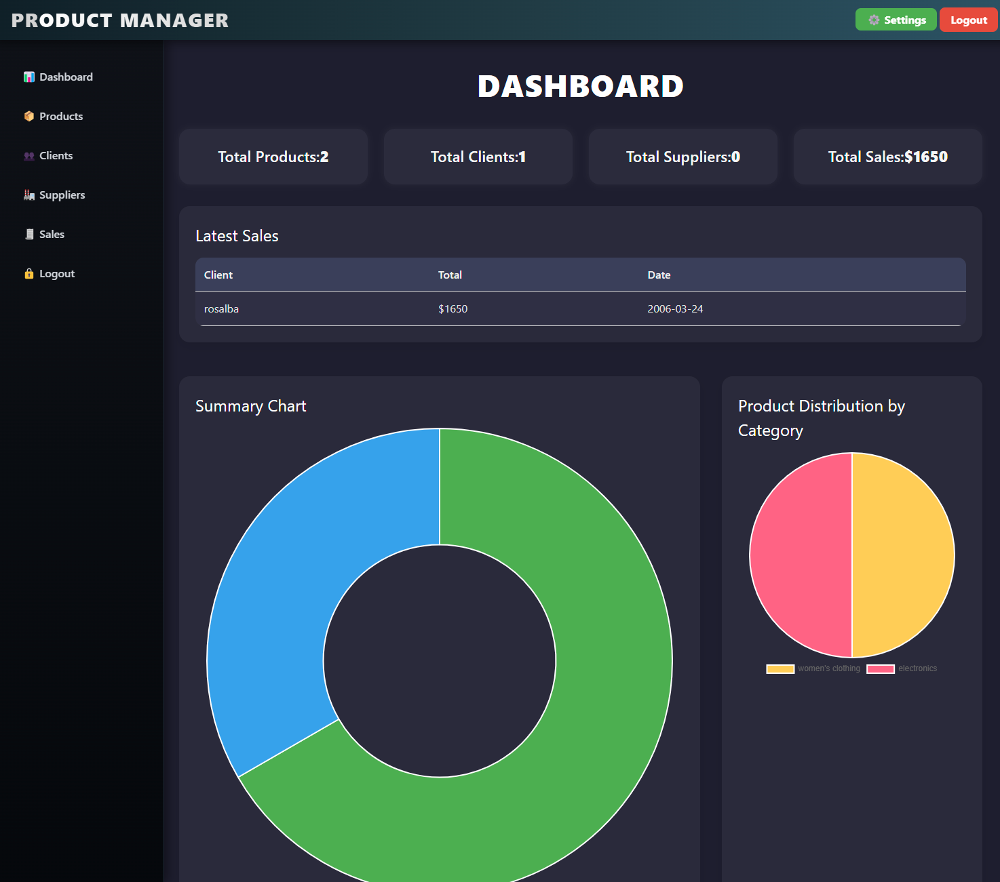
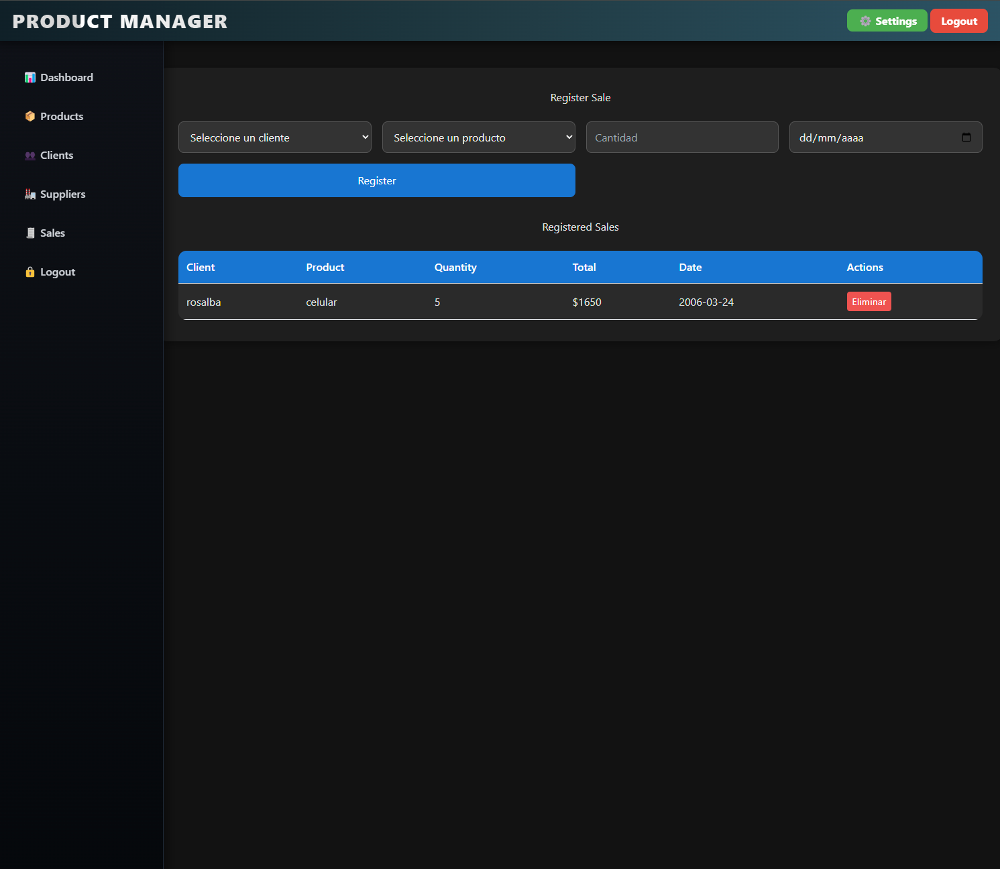
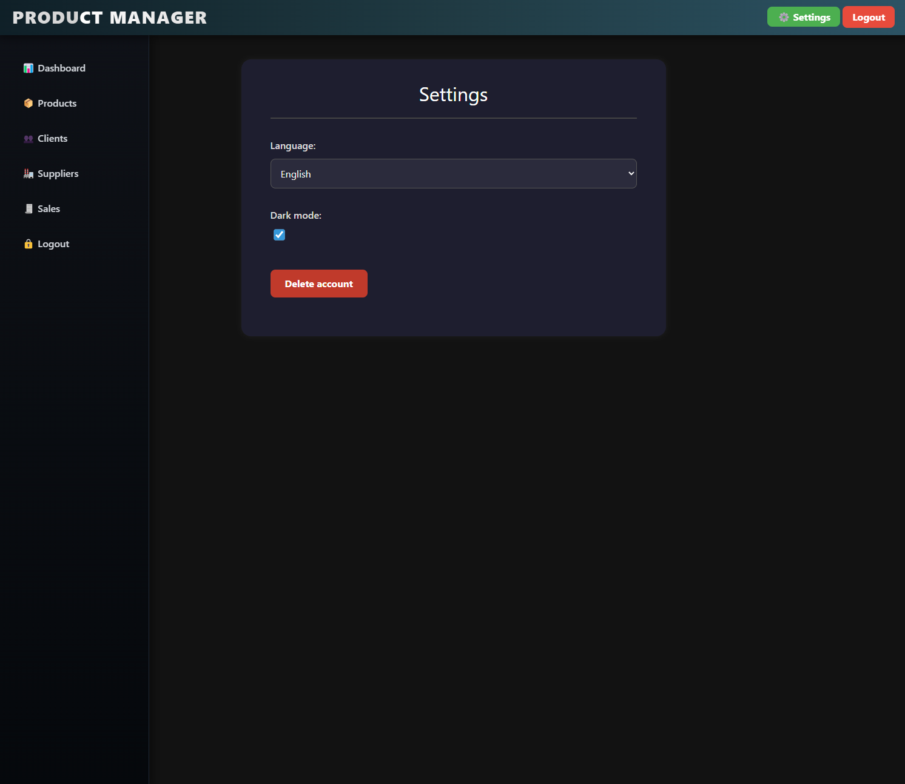

# Supplier Manager Web App

A lightweight, single-page web application to manage products, clients, suppliers, and sales. Built using Vanilla JavaScript, HTML, CSS, and TailwindCSS for styling. LocalStorage is used for data persistence.

---

## 📁 Project Structure

```
├── assets/
│   └── img/
├── components/
│   ├── navbar.js
│   └── sidebar.js
├── css/
│   ├── clientes.css
│   ├── configuracion.css
│   ├── dashboard.css
│   ├── login.css
│   ├── navbar.css
│   ├── productos.css
│   ├── proveedores.css
│   ├── sidebar.css
│   ├── signup.css
│   ├── style.css
│   └── ventas.css
├── js/
│   ├── animations.js
│   ├── api.js
│   ├── auth.js
│   ├── main.js
│   ├── router.js
│   └── views/
│       ├── clientes.js
│       ├── configuracion.js
│       ├── dashboard.js
│       ├── login.js
│       ├── productos.js
│       ├── proveedores.js
│       ├── signup.js
│       └── ventas.js
├── index.html
├── package.json
├── postcss.config.js
├── tailwind.config.js
└── README.md
```

---

## 🚀 Features

- 📦 Product Management  
- 👥 Client Management  
- 🏭 Supplier Management  
- 🧾 Sales Tracking  
- 🧑‍💻 Authentication (Login/Signup)  
- 🌙 Dark Mode  
- 🌐 Multi-language (English / Spanish)  
- 📊 Dashboard Overview  
- ⚙️ Settings Persistence via LocalStorage  

---

## 🔧 Technologies Used

- **Vanilla JavaScript**
- **TailwindCSS**
- **HTML5**
- **CSS3**
- **LocalStorage**

---

## 🧠 How It Works

The app is a single-page application (SPA) without frameworks. Navigation is managed using hash-based routing and the app dynamically renders views using JavaScript DOM manipulation.

- All components (navbar, sidebar) are modular JavaScript files.
- Views are loaded into the main container dynamically based on the route.
- `localStorage` is used to persist data across sessions.
- Settings like theme and language are stored and reapplied on load.
- Each major functionality (clients, products, etc.) is encapsulated in its own JS file in `js/views`.

---

## 🌐 Language Support

The app supports dynamic switching between **English** and **Spanish**, controlled via configuration settings. All text is dynamically translated using `data-key` attributes and translation maps.

---

## 🛠️ Getting Started

### 1. Clone the Repository

```bash
git clone https://github.com/yourusername/supplier-manager.git
cd supplier-manager
```

### 2. Install Dependencies

```bash
npm install
```

### 3. Run TailwindCSS Build (Optional)

If you’re customizing styles using TailwindCSS:

```bash
npx tailwindcss -i ./css/style.css -o ./dist/output.css --watch
```

### 4. Open index.html

You can use the **Live Server** extension in VSCode or simply open `index.html` in your browser.

---

## 🧪 Development Notes

- No backend is used — it’s 100% frontend and client-side.
- You can reset the app by clearing `localStorage` in your browser dev tools.
- Make sure JavaScript is enabled in your browser.
- Dark mode and language preference are saved in `localStorage`.

---

## 📸 Screenshots

> Add real screenshots of your dashboard, sales view, modals, and dark mode here.

```



```

---

## 📄 License

MIT License

---

## ✍️ Author

Developed by **Deivy Ariza**  
[GitHub Profile](https://github.com/DArizaLozano)
